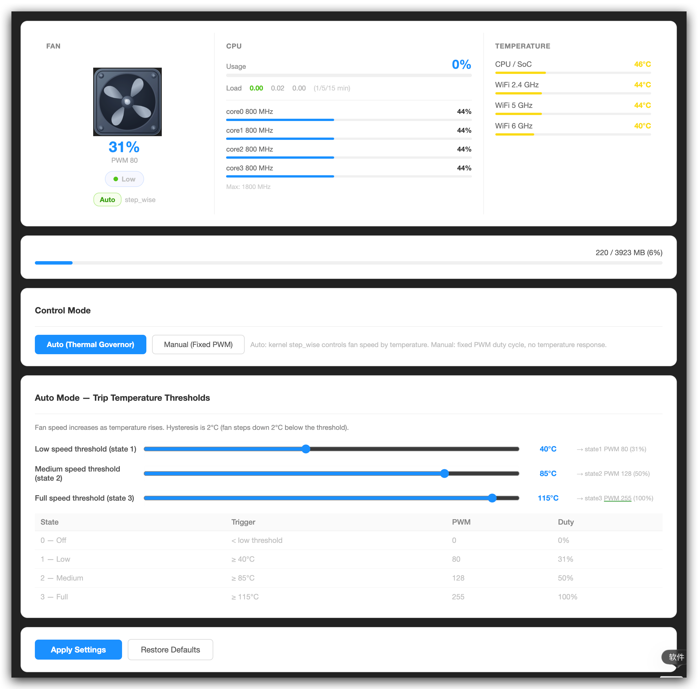

# luci-app-fan-bpir4

适用于 **Banana Pi BPI-R4**（联发科 MT7988A / Filogic 880）的 LuCI 风扇控制应用。

## 功能特性

- **实时仪表盘** — 仿 PC 机箱风扇动态图标（含 PWM 进度环）、每核 CPU 频率与使用率、负载均值、CPU/SoC 及三个 Wi-Fi 芯片温度、内存使用条
- **自动模式** — 调用内核 `step_wise` 温控调速器，可自定义低速 / 中速 / 全速触发温度
- **手动模式** — 固定 PWM 占空比，带死区警告（启动阈值 66/255，停转阈值 43/255）及快捷预设按钮
- **安全切换** — 切回自动模式时，根据当前温度预写正确 PWM 档位，防止 `step_wise` 接管后风扇仍然停转
- **国际化** — 支持英文与简体中文（zh-cn / zh_Hans）

## 截图



## 系统要求

- OpenWrt 23.05+ / ImmortalWrt 24.10+
- 目标平台：`mediatek/filogic`（BPI-R4）
- 依赖：`luci`

## 安装方式

### 从源码编译

将本包放入 OpenWrt 编译目录的 `package/` 下，然后：

```bash
make menuconfig   # Network → Web Servers/Proxies → luci-app-fan-bpir4
make package/luci-app-fan-bpir4/compile V=s
```

### 在设备上安装

```bash
opkg install luci-app-fan-bpir4_*.ipk
/etc/init.d/fan-bpir4 enable
/etc/init.d/fan-bpir4 start
```

## 配置说明

UCI 配置文件位于 `/etc/config/fan-bpir4`：

```
config fan-bpir4
    option mode        'auto'     # auto（自动）| manual（手动）
    option pwm         '128'      # 手动模式 PWM 值（0-255）
    option temp_low    '40'       # °C，触发档位1 PWM=80  (31%)
    option temp_med    '85'       # °C，触发档位2 PWM=128 (50%)
    option temp_high   '115'      # °C，触发档位3 PWM=255 (100%)
```

## 风扇硬件说明

在 BPI-R4 板载风扇（3线，无转速反馈）上实测：

| PWM | 占空比 | 行为 |
|-----|--------|------|
| 0   | 0%     | 停转 |
| ≤ 43 | ≤ 17% | **停转阈值** — 即使正在转动也会停 |
| 44–65 | 17–25% | **死区** — 无法从静止启动，已转动可维持 |
| ≥ 66 | ≥ 26% | **启动阈值** — 从静止启动所需最低 PWM |
| 255 | 100%  | 全速 |

## 开源协议

GPL-2.0
